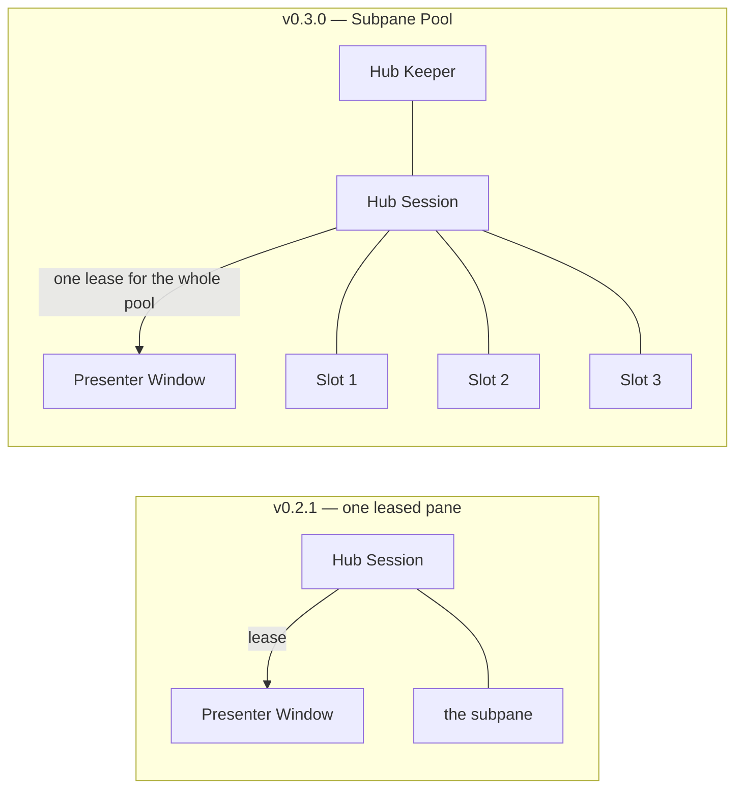
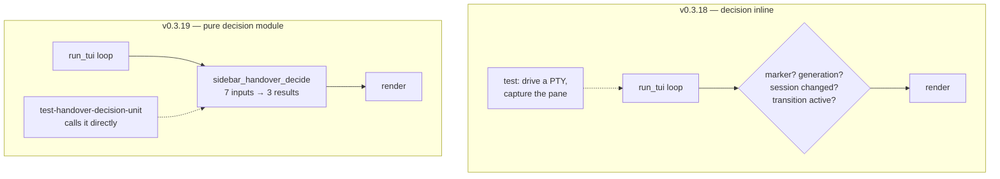
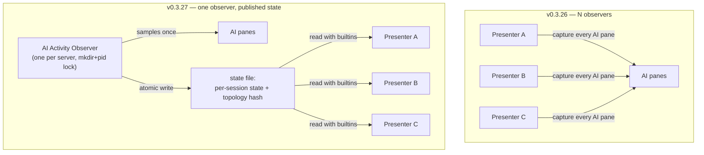
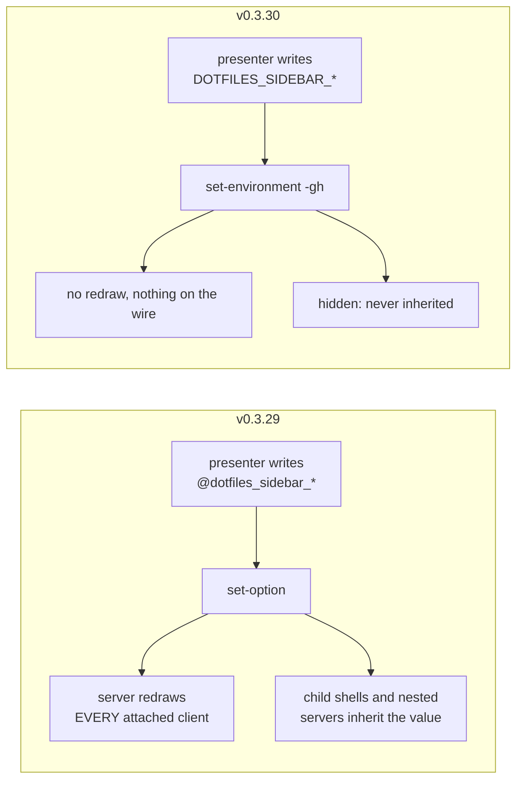
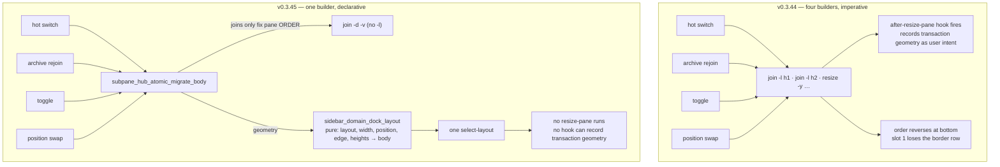
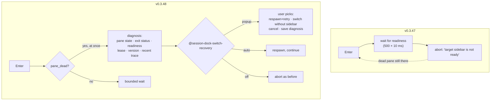
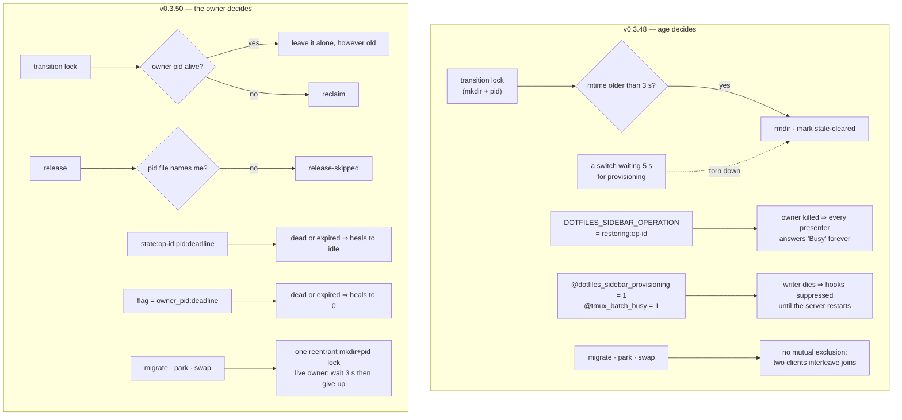

# Architecture Evolution

Eight points where the **shape** of this codebase changed, not just its
features. Each entry names the release before and after, says which **module**
moved, where its **seam** ended up, and draws the two shapes side by side.

Read this when you are about to change coordination, geometry, or the hot
paths: the diagrams say what the current shape is *for*, and the "why it moved"
line says which failure produced it. Current design: [ARCHITECTURE.md](ARCHITECTURE.md).
Open items: [BACKLOG.md](BACKLOG.md).

> **Not in this history.** `ARCHITECTURE.md` says the dock "replaces physical
> pane migration (`move-pane`)". That is a comparison against prior art, not a
> refactor you can find here: `move-pane` appears in no commit, and `v0.1.0`
> already switched sessions with native `switch-client`. Do not go looking for
> the migration.

| # | Change | Before → After | Shape |
| :-- | :--- | :--- | :--- |
| 1 | Subpane Pool gains slots | `v0.2.1` → `v0.3.0` | one leased pane → N slots with stable identity |
| 2 | Handover decision extracted | `v0.3.18` → `v0.3.19` | decisions inline in the loop → one pure decision module |
| 3 | AI observation shared | `v0.3.26` → `v0.3.27` (`v0.3.28`) | every presenter observes → one observer publishes |
| 4 | Transient state leaves options | `v0.3.29` → `v0.3.30` | `set-option` (redraws) → hidden `set-environment` |
| 5 | Dock geometry declared | `v0.3.44` → `v0.3.45` | join/resize arithmetic → one pure layout function |
| 6 | Switch failure becomes a result | `v0.3.47` → `v0.3.48` | abort → diagnosis + recovery choice |
| 7 | Liveness by owner | `v0.3.48` → `v0.3.50` | age heuristics and bare flags → pid + deadline |
| 8 | Hook cost decided in the server | `v0.3.50` → `v0.3.51` | every event spawns the bundle → gated, batched |

---

## 1. Subpane Pool gains slots — `v0.2.1` → `v0.3.0`

`fcf72fa` · +514 −260

The Hub session and the exclusive Lease already existed; what changed is that
the leased thing stopped being *a pane* and became **a pool of slots**, each
with an identity that survives movement between Presenter Windows.

**Interface change**: callers stopped naming a pane and started naming a
*count* and a *position*. **Leverage**: one lease moves N slots; the caller
learns no more than it did for one. **What it cost**: everything downstream had
to become N-agnostic, and the arithmetic that placed the slots did not — which
is change 5, four months later.

---

## 2. Handover decision extracted — `v0.3.18` → `v0.3.19`

`0bea219`, `be8b1b1`, `db10450` · new module `scripts/lib/sidebar_handover.sh` (45 lines)

The presenter loop decided, inline, whether an incoming marker meant *render
the delta*, *render everything*, or *ignore*. Those decisions were the source
of the flicker bugs and could only be tested by driving a real presenter.

**Depth**: seven inputs in, three results out; the caller applies them. The
**seam** sits exactly where the test wants it, so the decision table is unit
tested and the loop keeps only the applying. This is the pattern the pure
`sidebar_domain*` modules follow.

---

## 3. AI observation shared — `v0.3.26` → `v0.3.27`, completed in `v0.3.28`

`6588422` (+967 −180), `fe12036`

Each presenter sampled every AI pane once a second. With five sidebars that is
five identical `capture-pane` sweeps per second, and they disagreed with each
other.

**Locality**: one process decides what "running" means, so presenters cannot
disagree. **Leverage** arrived one release later: because the file carries a
change key, a presenter whose key is unchanged skips its collect entirely and
issues **no tmux command at all** while idle (`v0.3.28`). Measured today: an
idle presenter's observer reports ~70 skips per 16 collects.

---

## 4. Transient state leaves options — `v0.3.29` → `v0.3.30`

`e5ff06b` · +445 −251 across 13 files

Every `set-option`, at any scope, makes the tmux server redraw every attached
client — roughly 800 bytes on the wire per write. Handover bookkeeping was
being written this way many times per switch.

**The rule that came out of it**, still enforced: options hold **durable
identity** only (which pane is the sidebar, which window holds the lease);
everything transient — transition state, handover flags, selection-sync ack,
readiness, force-refresh, guard deadlines — lives in hidden global environment
variables. `-h` matters as much as the redraw: a plain global variable is
exported into every new pane, and a shell that started a nested tmux server
carried a stale `restoring:` into it.

---

## 5. Dock geometry declared — `v0.3.44` → `v0.3.45`

`eb3eb89`, `4033344` · +794 −499 · new pure function `sidebar_domain_dock_layout`

Four code paths each built the dock column with cumulative `join-pane -l`
arithmetic plus `resize-pane` passes. Slot order reversed at the bottom
position, and slot 1 lost a row whenever `pane-border-status top` charged the
`y=0` leaf. Worse, `resize-pane` fires `manual-resize`, so the builder's own
geometry was being recorded as the *user's* height intent.

**Deletion test**: deleting `sidebar_domain_dock_layout` would not move
complexity, it would re-scatter it across four call sites — it earns its keep.
**Testability**: the whole geometry rule, including the border-edge charge and
the vertical budget, is exercised by `test-subpane-dock-layout-unit` with
string equality and no tmux server. It is also the reason the slot limit of 3
is now policy rather than arithmetic (BACKLOG R4).

---

## 6. Switch failure becomes a result — `v0.3.47` → `v0.3.48`

`1417461`

When a target window's presenter pane was dead (a killed presenter leaves a
`remain-on-exit` shell), `Enter` polled the full provisioning budget and then
printed one line. The pane was never respawned, so every later `Enter` failed
the same way.

**Interface change**: `ensure_target_sidebar_window` stopped being a function
whose only output was "a pane id or nothing". It now reports *why* it failed —
which forced the result contract in change 7. The popup runs **outside** the
transaction, because holding it would block every other switch on the server
for as long as the user deliberates.

---

## 7. Liveness by owner — `v0.3.48` → `v0.3.49` → `v0.3.50`

`b8dcc70`, `2a28096`

Coordination state was judged by *age*: a transition lock older than 3 s was
declared stale and removed by any passing hook handler. But a switch may
legitimately wait 5 s for provisioning, so a live transition was being torn
down by another process, which then reclaimed the lock — and the original
switch deleted *that* lock on its way out.

**The rule**: identity may be a bare option; anything transient carries an
owner pid, a deadline, or both. Age heuristics cannot tell a slow-but-alive
writer from a dead one, and this codebase has plenty of legitimately slow ones.
Four contract tests now hold this shape in place, each red on the release
before it.

---

## 8. Hook cost decided in the server — `v0.3.50` → `v0.3.51`

`7dbad46`

Sixteen global hooks each ran `run-shell -b '<dist> --…'`, so every pane focus
change, split, resize and kill in **any** window parsed an 11k-line bundle
(~45 ms) just to discover, four tmux round trips later, that the window had no
ready sidebar and there was nothing to do.

```mermaid
graph TD
    subgraph BEFORE["v0.3.50 — decide in bash"]
        EV1["pane focus change<br/>in ANY window"] --> RS1["run-shell -b dist --sync-sidebar-focus"]
        RS1 --> PARSE["parse 11k lines ≈ 45 ms"]
        PARSE --> Q1["transition active?"]
        Q1 --> Q2["hook guard?"]
        Q2 --> Q3["operation busy?"]
        Q3 --> Q4["find sidebar pane"]
        Q4 --> Q5["window ready?"]
        Q5 --> OUT1["…no. return 0.<br/>20 tmux execs, 178 ms"]
    end
    subgraph AFTER["v0.3.51 — decide in tmux"]
        EV2["pane focus change"] --> GATE{"if-shell -F gate:<br/>is @dotfiles_sidebar_ready 1 ?"}
        GATE -->|"no ready sidebar"| ZERO["no process at all"]
        GATE -->|ready| RS2["run-shell -b dist --sync-sidebar-focus"]
        RS2 --> PRE["sidebar_hook_preflight<br/>3 preconditions, ONE show-environment"]
        PRE --> PROBE["sidebar_window_probe<br/>pane · dead · pid · width · ready · managed<br/>ONE list-panes"]
        PROBE --> OUT2["6 tmux execs, 94 ms"]
    end
```

**Measured**, tmux 3.2a, counting shim in front of the binary:

| | `v0.3.50` | `v0.3.51` |
| :--- | ---: | ---: |
| window with no sidebar: 20 focus changes + split + kill-pane | 21 processes | **0** |
| one `--sync-sidebar-focus` | 178 ms / 20 execs | **94 ms / 6 execs** |
| two idle presenters + observer | 13.0 execs/s | **7.7 execs/s** |
| warm session switch | ~350 ms | **~235 ms** |

The **seam moved into the tmux server**: the cheapest place to answer "is this
event mine?" is the process that already knows. Two traps the work surfaced and
the code now guards: a tmux command sequence aborts at the first failure (3.2a
is missing six of these hooks, so `set-hook` stays one call each), and a poll
that gets cheaper must not therefore get more frequent — making the readiness
probe cheap tripled its rate and starved the presenter it was waiting for,
doubling a cold switch until the interval was backed off.

---

## Reading the arc

Four of the eight moved a decision to where it is cheapest and hardest to get
wrong: into a pure function (2, 5), into one process (3), into the tmux server
(8). Three replaced a heuristic with an owner (6, 7) or a redraw with silence
(4). One (1) added capability and left an arithmetic debt that took until
change 5 to pay off — which is the honest lesson: widening an interface before
the implementation behind it is deep enough just moves the complexity to the
callers.
