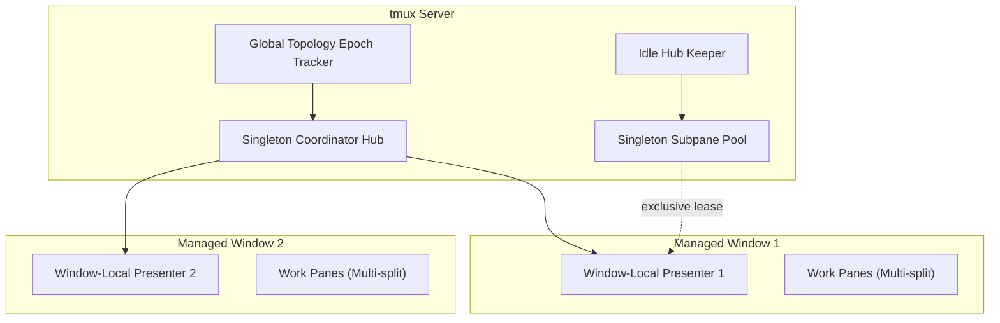

# tmux-session-dock Architecture & IPC Design

## 1. System Overview

`tmux-session-dock` replaces legacy, fragile physical pane migration models (`move-pane`) with the **Window-Local Thin Presenter + Singleton Coordinator Hub** architecture.

## 2. Core Invariants

1. **Window-Local Presenters**: Every managed window maintains its own lightweight Presenter pane.
2. **Native `switch-client`**: Session switching executes pure native client switching without moving physical panes across windows.
3. **0.75ms Fast-Path & In-Flight Handover**: In-place switching returns within 0.75ms with zero screen flicker.
4. **Clean Shared History**: Session archive and restoration (`o`) preserves shell history with Zero Time-Travel Pollution.
5. **24-Phase Waveform Gradient**: One shared AI Activity Observer per tmux server samples every AI pane once per second and publishes a state file (per-session state plus a topology hash and the attached-client list); presenters read it with builtins and collect only when that summary changed, so an idle presenter issues no tmux commands. Presenters write a heartbeat before every read; the observer's watchdog logs a presenter whose heartbeat stalls while its process is alive (`TMUX_SESSION_SIDEBAR_WATCHDOG=log`, default) and can send Escape to unblock it (`recover`), never while a prompt is open. Only the presenter with an attached client animates the wave, at 24 FPS (one cycle per second).

## 3. Subpane Pool Invariants

1. **Stable Slot Identity**: Each configured Subpane Slot has exactly one canonical tmux pane identity for the lifetime of the tmux server.
2. **Exclusive Lease**: The complete Subpane Pool is attached to at most one Presenter Window; source windows retain no duplicate slot roles.
3. **Idle Hub Keeper**: One unmarked idle pane keeps the infrastructure session alive while all Subpane Slots are leased out. It never runs a shell, renders content, or participates in a slot.
4. **Direct Lease Movement**: Canonical slots move directly from the current Presenter Window to the next. The Hub is used for parking while disabled, not as an intermediate migration stage.
5. **Mutation-Only Reconciliation**: Global identity reconciliation runs only during topology mutation. There is no background polling, forced client refresh, or redraw loop.
   Transient bookkeeping (transition/handover flags, selection-sync ack, target marker, input/prompt readiness, operation state, force-refresh requests) lives in hidden tmux global environment variables (`set-environment -gh DOTFILES_SIDEBAR_<NAME>[_<scope>]`; hidden so pane shells and nested servers never inherit them), never in `set-option`: every `set-option`, at any scope, redraws every attached client (~800 B per write), while `set-environment` emits nothing. Only durable identity/topology (`@dotfiles_sidebar_pane`, `@dotfiles_sidebar_managed`, subpane lease, layout spec) stays in options, and related writes are batched into one chained tmux call. A lease transaction (park to the hub, rebuild, position swap) raises `DOTFILES_SIDEBAR_SUBPANE_TRANSACTION` (hidden, epoch deadline) for its duration; User Height Intent snapshots from other processes (hook handlers) are refused while it is up, so transaction geometry is never recorded as the user's.
6. **Caller-Owned Focus**: Subpane Pool movement preserves the active pane. Session-switch and user-entry callers own focus decisions.
