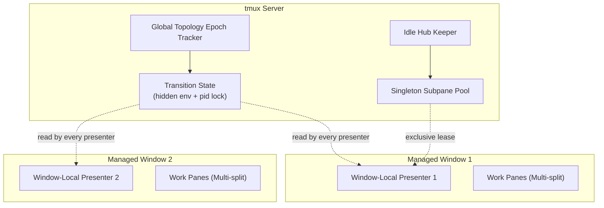

# tmux-session-dock Architecture & IPC Design

Describes `v0.3.51`. Numbers quoted here were measured on tmux 3.2a (WSL2);
open items and the reasoning behind recent changes are in
[BACKLOG.md](BACKLOG.md).

## 1. System Overview

`tmux-session-dock` replaces physical pane migration (`move-pane`) with **Window-Local Thin Presenters** that coordinate through shared server state rather than through a central process.

There is no coordinator daemon. Every managed window runs one presenter (a bash TUI in a 34-column pane); they agree by reading and writing the same tmux server state - hidden global environment variables for transient bookkeeping, tmux options for durable identity, and filesystem `mkdir`+pid locks where mutual exclusion is required. The only extra processes on a server are the one AI Activity Observer and the Subpane Hub keeper.

## 2. Core Invariants

1. **Window-Local Presenters**: Every managed window maintains its own lightweight Presenter pane.
2. **Native `switch-client`**: Session switching executes pure native client switching without moving physical panes across windows.
3. **Bounded Switch, No Flicker**: Pressing Enter on the current session returns immediately (a fast path that never touches the server). A switch to another session whose presenter is already settled completes in roughly 235 ms end to end; a switch to a session whose presenter has not yet rendered a frame is bounded by that presenter, roughly 1 s. Both are measured from `switch.begin` to `switch.end` in the trace on tmux 3.2a. The target window is built before `switch-client`, so the client never lands on a half-built window.
4. **Clean Shared History**: Session archive and restoration (`o`) preserves shell history with Zero Time-Travel Pollution.
5. **24-Phase Waveform Gradient**: One shared AI Activity Observer per tmux server samples every AI pane once per second and publishes a state file (per-session state plus a topology hash and the attached-client list); presenters read it with builtins and collect only when that summary changed, so an idle presenter issues no tmux commands. Presenters write a heartbeat before every read; the observer's watchdog logs a presenter whose heartbeat stalls while its process is alive (`TMUX_SESSION_SIDEBAR_WATCHDOG=log`, default) and can send Escape to unblock it (`recover`), never while a prompt is open. Only the presenter with an attached client animates the wave, at 24 FPS (one cycle per second).

6. **IME Follows Sidebar Focus (opt-in)**: `@session-dock-ime on|restore` installs a `pane-focus-in` hook that switches the OS input method to English when the sidebar pane gains focus, by any route (key, mouse, hook, session switch); `restore` adds a `pane-focus-out` hook that puts the previous mode back on leave. The pane-title compare runs inside tmux (`if-shell -F`), so a focus change elsewhere costs no process; only a sidebar focus forks the one-shot helper `tmux-session-dock-ime` (`en|push|pop`), which delegates to `~/.local/bin/imemode.exe` on WSL2 — built locally from `bin/win/imemode.cs`, it flips the IME conversion mode that layout switchers like im-select cannot see and restores only while the same Windows window is still in front — or drives `fcitx5-remote` / `fcitx-remote` / `ibus` / `im-select` / `macism` on Linux/macOS. Both hooks append to the hook arrays and remove only their own entry. They need an attached focused client, so headless servers (tests, CI) never touch an IME.

## 3. Subpane Pool Invariants

1. **Stable Slot Identity**: Each configured Subpane Slot has exactly one canonical tmux pane identity for the lifetime of the tmux server.
2. **Exclusive Lease**: The complete Subpane Pool is attached to at most one Presenter Window; source windows retain no duplicate slot roles.
3. **Idle Hub Keeper**: One unmarked idle pane keeps the infrastructure session alive while all Subpane Slots are leased out. It never runs a shell, renders content, or participates in a slot.
4. **Direct Lease Movement**: Canonical slots move directly from the current Presenter Window to the next. The Hub is used for parking while disabled, not as an intermediate migration stage.
5. **Mutation-Only Reconciliation**: Global identity reconciliation runs only during topology mutation. There is no background polling, forced client refresh, or redraw loop.
   Transient bookkeeping (transition/handover flags, selection-sync ack, target marker, input/prompt readiness, operation state, force-refresh requests, the layout-hook guard deadline) lives in hidden tmux global environment variables (`set-environment -gh DOTFILES_SIDEBAR_<NAME>[_<scope>]`; hidden so pane shells and nested servers never inherit them), never in `set-option`: every `set-option`, at any scope, redraws every attached client (~800 B per write), while `set-environment` emits nothing. Only durable identity/topology (`@dotfiles_sidebar_pane`, `@dotfiles_sidebar_managed`, subpane lease, layout spec) stays in options, and related writes are batched into one chained tmux call. A lease transaction (park to the hub, rebuild, position swap) raises `DOTFILES_SIDEBAR_SUBPANE_TRANSACTION` (hidden, epoch deadline) for its duration; User Height Intent snapshots from other processes (hook handlers) are refused while it is up, so transaction geometry is never recorded as the user's.
   Sidebar provisioning is idempotent under concurrency: creators of the same window serialize on a per-window lock (`<lock root>/dotfiles-sidebar-provision-<socket>-<window>.lock`), and duplicate reconciliation always keeps the lowest pane id, so two provisioners (an explicit ensure and a session hook) reach the same canonical pane instead of killing each other's.
6. **Declared Dock Geometry**: The dock column is built by one function (`subpane_hub_atomic_migrate_body`). Joins only fix pane order (slot 1 next to the sidebar, slot k after slot k-1 — tmux assigns layout leaves in pane-list order); the geometry of the whole window is declared once per lease transaction as a layout string from the pure `sidebar_domain_dock_layout` (per-slot heights, position, the `pane-border-status` edge charge, an explicit vertical budget) and applied with a single `select-layout`. No `resize-pane` runs, so no hook can record transaction geometry as a user intent. The stack is built in the target window *before* `switch-client`, because the presenter that runs a switch is recycled by the active-window hooks right after it. Every slot mutation (migrate, park, position swap) runs under one mkdir+pid lock per server (`subpane_hub_lock_acquire`, reentrant, dead owner reclaimed, live owner waited for up to 3 s); the transaction marker only tells observers to skip snapshots and is not mutual exclusion. Hook-suppression flags (`@dotfiles_sidebar_provisioning`, `@dotfiles_sidebar_restore_topology`, `@tmux_batch_busy`) carry `owner_pid:deadline` and heal to inactive when the owner dies.
7. **Server-Side Hook Gating**: Layout and focus hooks are installed wrapped in `if-shell -F '#{==:#{@dotfiles_sidebar_ready},1}'`, so a pane focus change, split or kill in a window with no ready sidebar costs no process at all - the test asserts 0 spawns where there used to be one per event. The same readiness was already required inside `sync_sidebar_layout`/`sync_sidebar_focus`, so nothing that used to happen stops happening; it just stops paying for an 11k-line interpreter to find that out. Each `set-hook` is issued separately on purpose: several hooks do not exist on every tmux version (3.2a lacks `after-join-pane`, `after-break-pane`, `after-rotate-window`, `after-swap-pane`, `after-link-window`, `window-resized`) and one failure would end a compound sequence, silently dropping every hook after it.
8. **One Round Trip Per Question**: The hot paths ask the server once for everything they need - `sidebar_window_probe` (sidebar pane, liveness, pid, width, readiness, managed flag, pane count from one `list-panes`), `sidebar_env_fetch_all` (every hidden flag, plus an optional pane/window format, from one `show-environment -gh`), `sidebar_env_set_many` (several flags in one write, one redraw), and the batched layout snapshot in `save_sidebar_layout`. Readiness waits poll cheap flags and capture the pane only once the flags say a frame exists, with the interval backing off after the first few cycles: a poll that costs the server less must not therefore run more often, or it starves the presenter it is waiting for. The presenter's once-a-second fallback poll takes one snapshot and **invalidates it immediately afterwards**, because a flag published between the snapshot and a signal-driven consumer in the same loop iteration would otherwise wait a full cycle.
9. **Switch Recovery**: When Enter cannot land on a session because its Presenter pane is dead (a killed or crashed presenter leaves a remain-on-exit shell) or never became ready, the switch does not poll into the provisioning budget: a dead pane is detected at once and, per `@session-dock-switch-recovery`, the user sees a popup with the diagnosis (pane state, exit status, readiness, lease, recent trace) and chooses respawn-and-retry / switch without a sidebar / cancel / save the diagnosis (`popup`, default), or the sidebar is respawned silently (`auto`), or the switch aborts as before (`off`). The transaction is released while the popup is open - holding it would block every other switch on the server for as long as the user deliberates - and the chosen retry runs as a fresh transaction. Transition and operation liveness is decided by owner pid (and, for operations, a deadline), never by lock age: a slow but alive switch is not torn down.
10. **Caller-Owned Focus**: Subpane Pool movement preserves the active pane. Session-switch and user-entry callers own focus decisions.

## 4. Where the history is

Each invariant above was introduced by one release; `git log --oneline -- docs/ARCHITECTURE.md`
and the annotated tags carry the reasoning. The releases that shaped the
current design:

| Tag | What changed |
| :--- | :--- |
| `v0.3.45` | Dock geometry declared once per lease transaction (invariant 6) |
| `v0.3.47` | `setup.sh uninstall` stopped killing the tmux server; `--kill-server` is opt-in |
| `v0.3.48` | Switch recovery popup (invariant 9) |
| `v0.3.49` | Transition and operation liveness by owner pid, not lock age |
| `v0.3.50` | Slot mutation lock; hook-suppression flags carry owner and deadline |
| `v0.3.51` | Server-side hook gating and one-round-trip hot paths (invariants 7, 8) |
