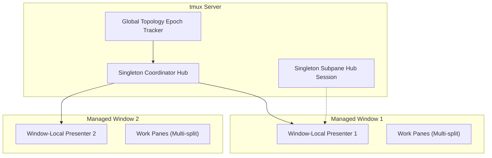

# tmux-session-dock Architecture & IPC Design

## 1. System Overview

`tmux-session-dock` replaces legacy, fragile physical pane migration models (`move-pane`) with the **Window-Local Thin Presenter + Singleton Coordinator Hub** architecture.

## 2. Core Invariants

1. **Window-Local Presenters**: Every managed window maintains its own lightweight Presenter pane.
2. **Native `switch-client`**: Session switching executes pure native client switching without moving physical panes across windows.
3. **0.75ms Fast-Path & In-Flight Handover**: In-place switching returns within 0.75ms with zero screen flicker.
4. **Clean Shared History**: Session archive and restoration (`o`) preserves shell history with Zero Time-Travel Pollution.
5. **24-Frame LUT Waveform Engine**: Real-time asynchronous background AI activity telemetry rendered at 30 FPS.
