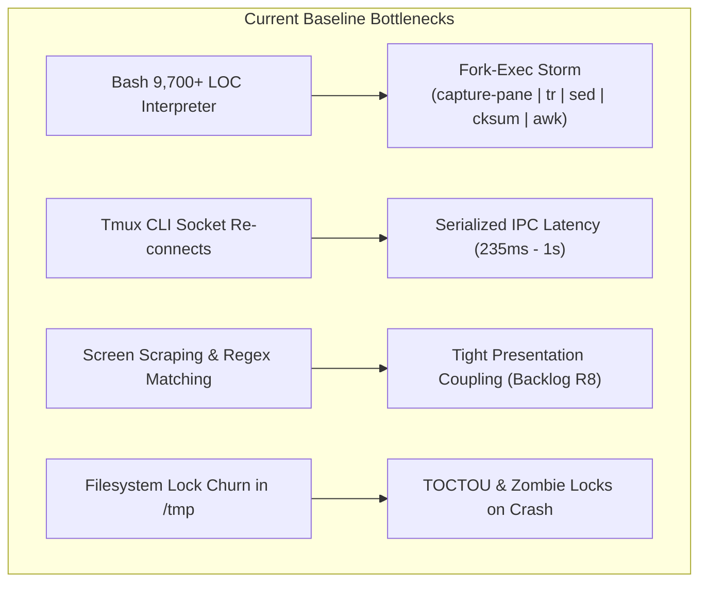

# High-Performance & Native Core Architecture Roadmap

Documents the optimization and modernization path for `tmux-session-dock`, targeting sub-millisecond execution, zero-fork observation, 60 FPS flicker-free gradient rendering, and rock-solid stability comparable to modern native CLI tools (e.g. Antigravity).

---

## 1. Objectives & Performance Targets

| Metric | Current (Bash v0.3.63) | Phase 1 (Zero-Fork Bash) | Phase 2 (Hybrid Rust Observer) | Phase 3 (Native Rust Core) |
| :--- | :--- | :--- | :--- | :--- |
| **Startup / Invocation Latency** | 45 ms – 120 ms | 15 ms – 35 ms | 1.0 ms – 2.5 ms | **< 0.8 ms** |
| **Warm Session Switch Time** | ~235 ms | ~80 ms – 120 ms | ~30 ms – 50 ms | **< 5 ms** |
| **AI Observer Fork Rate** | 50 – 80 forks/sec (10 panes) | 0 forks/sec (`/proc` reads) | 0 forks/sec (async I/O) | **0 forks/sec** |
| **CPU Usage on WSL2 (Idle/AI)** | 10% – 25% of 1 core | 0.5% – 1.5% | 0.05% – 0.2% | **< 0.01% (0.00% idle)** |
| **Memory Footprint (RSS)** | ~12 MB (Bash + subshells) | ~8 MB | ~4 MB | **1.8 MB – 3.2 MB** |
| **Gradient Animation Frame Rate** | 24 FPS (via `read -t`) | 24 FPS (via `read -t`) | 30 FPS | **60 FPS (Delta double-buffer)** |

---

## 2. Root-Cause Bottleneck Analysis



1. **Process Creation Overhead (Fork-Exec Storm)**:
   - `session_ai_fingerprint_for_pane` spawns a 5-stage pipeline (`capture-pane`, `tr`, `sed`, `sed`, `cksum`, `awk`).
   - For 10 active AI panes at 1 Hz, this creates 50–80 forks/execs per second. On WSL2, hypervisor context switches consume up to 25% of a CPU core.
2. **Tmux CLI Re-invocation Overhead**:
   - Each `tmux display-message`, `tmux list-panes`, and `tmux show-option` runs a separate client process, performs socket handshakes, parses arguments, and serializes text.
3. **Screen Scraping Coupling (Backlog R8)**:
   - Session switch completion verification inspects terminal output via `capture-pane` and regex matching (`sidebar_content_matches`), coupling the transition state machine to volatile UI glyphs.
4. **Filesystem Lock Churn**:
   - `mkdir` + PID hardlink synchronization in `/tmp` incurs 9+ VFS syscalls per lock operation and risks stale locks if a process terminates abnormally.

---

## 3. Core Domain Invariants to Preserve

Any accelerated or native architecture must strictly preserve all invariants from [`docs/ARCHITECTURE.md`](ARCHITECTURE.md) and [`CONTEXT.md`](../CONTEXT.md):

1. **Window-Local Thin Presenters (Invariant 1)**: Every managed window maintains its own lightweight presenter pane. Rendering remains window-local to eliminate cross-window flicker and support independent multi-client attachments.
2. **Native `switch-client` (Invariant 2)**: Transitions execute native client switching without moving physical panes across windows.
3. **AI Activity State Machine (Invariant 5)**: The four canonical states (**Working**, **Awaiting**, **Idle**, **Absent**) and the 24-phase waveform gradient must maintain identical semantic definitions.
4. **Declared Dock Geometry & Subpane Leases (Invariant 6)**: Subpane slot layouts are computed and applied atomically in a single `select-layout` pass.
5. **Switch Recovery (Invariant 9)**: Unready or dead presenter panes must be detected immediately without stalling, offering popup diagnostics or auto-respawn.
6. **Zero Time-Travel Pollution & Caller-Owned Focus**: Shell histories and active user focus are strictly preserved during all background operations.

---

## 4. Phased Implementation Roadmap

```mermaid
graph LR
    subgraph "Phase 1: Zero-Fork Bash (Immediate)"
        P1_1["R8: Generation Token Readiness"]
        P1_2["Direct /proc stat/io AI Reading"]
        P1_3["Batched Tmux CLI Invocations"]
    end

    subgraph "Phase 2: Hybrid Rust Observer (Medium-Term)"
        P2_1["1.8MB Rust Observer Daemon"]
        P2_2["Kernel flock / Abstract UDS"]
        P2_3["TPM Prebuilt Release Pipeline"]
    end

    subgraph "Phase 3: Native Rust Core TUI (Long-Term)"
        P3_1["Ratatui Double-Buffered TUI Engine"]
        P3_2["60 FPS Precomputed LUT Gradient"]
        P3_3["< 5ms End-to-End Switch Latency"]
    end

    Phase 1 --> Phase 2 --> Phase 3
```

### Phase 1: Zero-Fork Bash & R8 Resolution (Immediate)

* **Goal**: Maximize pure Bash performance, eliminate subshell cascades, and decouple switch verification from presentation text.
* **Key Deliverables**:
  1. **Resolve Backlog R8 (Render Generation Counter)**:
     - Replace `capture-pane` screen-scraping with an atomic sequence counter (`HANDOVER_RENDER_GEN_<window>`) incremented post-render.
     - Switch logic checks generation matching rather than regex text, preventing switch failures upon header/mark styling updates.
  2. **Screen-Scrape-Free AI Activity Detection**:
     - Replace the `capture-pane | tr | sed | cksum | awk` pipeline with direct built-in reads of `/proc/<pid>/stat` (CPU ticks 14–17) and `/proc/<pid>/io` (`rchar`/`wchar`).
     - Zero subshell forks per observation cycle.
  3. **Batched Tmux CLI Queries**:
     - Consolidate multiple queries into compound commands (`tmux list-panes ... \; list-clients ...`) in a single round-trip.

### Phase 2: Hybrid Rust Observer & Kernel Locking (Medium-Term)

* **Goal**: Offload background observation and synchronization to a lightweight native binary while keeping the Bash Presenter intact.
* **Key Deliverables**:
  1. **Lightweight Rust AI Observer (`tmux-session-dock --observe`)**:
     - Single static binary (< 1.8 MB stripped musl) replacing `run_ai_observer`.
     - Zero-alloc procfs parsing and in-memory activity state machine.
     - Publishes state deltas to the existing shared state file / Unix Domain Socket.
  2. **Kernel `flock` & Abstract UDS Mutex**:
     - Replace `/tmp` `mkdir` + hardlink locks with kernel-managed file descriptor locks (`flock`) or Linux abstract namespace sockets (`@tmux-session-dock-lock`).
     - Automatic lock reclamation on process crash with zero stale-lock hazard.
  3. **Zero-Friction TPM Compatibility**:
     - Precompiled binaries published via GitHub Releases (Linux x86_64/arm64 musl, macOS Darwin).
     - Transparent fallback to pure Bash if the native binary is absent or unsupported.

### Phase 3: Native Rust Core TUI Presenter (Long-Term)

* **Goal**: Deliver Antigravity-class responsiveness (< 5ms switches, 60 FPS wave gradient, < 2MB RSS).
* **Key Deliverables**:
  1. **High-Performance Native Presenter**:
     - Replaces `scripts/tmux-session-dock` TUI loop with a `ratatui` + `crossterm` native engine.
     - Sub-millisecond startup latency (< 0.8 ms).
  2. **Double-Buffering & Delta Rendering Engine**:
     - Front/back terminal cell comparison: only emits ANSI escape sequences for modified cells.
     - Precomputed 24-phase trigonometric RGB Lookup Table (LUT) for $O(1)$ gradient updates.
     - Automatic sleep when no session is in `Working` state (0.00% idle CPU).
  3. **Unified Multi-Call Binary**:
     - Single executable supporting `presenter`, `observer`, `palette`, and `picker` subcommands.

---

## 5. Technical Architecture Blueprints

### A. Screen-Scrape-Free Procfs Detection (Zero-Fork)

```
[Target Process /proc/<pid>]
       │
       ├── /proc/<pid>/stat (Fields 14-17: utime, stime, cutime, cstime)
       │     └─► ΔTicks > Threshold : Active computation / reasoning (Working)
       │
       ├── /proc/<pid>/io (Fields: rchar, wchar)
       │     └─► Δwchar > 0 : PTY text streaming
       │
       └── /proc/<pid>/wchan
             └─► n_tty_read / epoll_wait : Waiting for prompt input (Awaiting / Idle)
```

### B. Delta Double-Buffering Render Pipeline

```
┌─────────────────┐       ┌─────────────────┐       ┌──────────────────────────────────────┐
│  Back Buffer    │       │  Front Buffer   │       │ Delta-Render Pipeline                │
│  (Next Frame)   │ Diff  │ (Current Frame) │ ───►  │ • Skip identical cells               │
│ [Width x Height]│ ────► │ [Width x Height]│       │ • Cluster consecutive modified runs  │
│                 │       │                 │       │ • Emit ANSI jumps only on run splits │
└─────────────────┘       └─────────────────┘       └──────────────────┬───────────────────┘
                                                                       │ Direct I/O
                                                                       ▼
                                                            Terminal Output Stream
```

### C. Kernel-Managed Non-Blocking `flock` Pattern

```bash
ai_observer_acquire_flock()
{
    local lock_file="${TMUX_SESSION_LAUNCHER_LOCK_ROOT:-/tmp}/tmux-dock-observer.lock"
    exec 200>"$lock_file" || return 1
    if ! flock -n 200; then
        exec 200>&- # Lock held by another live process; close FD and exit
        return 1
    fi
    # Lock held automatically in kernel memory until process exits or FD closes
    return 0
}
```
